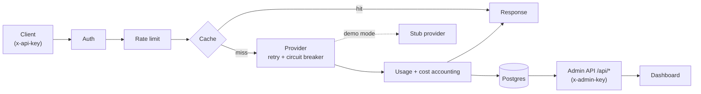

# LLM Gateway

[](https://github.com/KaloyanYordanov12/llm-gateway/actions/workflows/ci.yml)
[](LICENSE)

An Anthropic-compatible LLM gateway: a single self-hosted service that sits in
front of LLM providers and adds the operational layer you actually need in
production. Clients call it with an `x-api-key`; it authenticates them,
rate-limits per client, serves responses from a cache, and proxies to a provider
behind retry + a circuit breaker — with **automatic failover across a provider
chain, config-driven per-model routing, and opt-in SSE streaming** — while
recording token usage and cost. A read-only admin API and a bundled dashboard
expose the numbers.

Built with Java 25 and Spring Boot 4.1.1, correctness enforced by an
un-cheatable `mvnw verify` (coverage, mutation, static analysis), containerized,
and deployed live.

## Live demo

**<https://gateway.kaloyanyordanov.dev/>** — open the dashboard and enter the
admin key to view live telemetry; health is at
[`/actuator/health`](https://gateway.kaloyanyordanov.dev/actuator/health).

> **The public deployment runs in demo mode and costs nothing, by design.** It is
> configured with `GATEWAY_PROVIDER_MODE=demo`, which selects a **stub provider**
> that returns a canned response and makes **no real model call** — so no amount
> of traffic to the public box can spend a cent. Everything else is real: the
> request still flows through auth, rate limiting, the cache, and usage/cost
> accounting, so the dashboard shows genuine numbers. Switching to the real
> Anthropic provider is a single flag: `GATEWAY_PROVIDER_MODE=live`. `live` is the
> fail-secure default in code; `demo` is a loud, explicit opt-in for the public
> box.

## Architecture



Requests enter through servlet filters (auth → rate limit), reach the proxy,
which checks the cache and, on a miss, routes to a provider behind Resilience4j
retry + circuit breaker — failing over across the provider chain when one is
unhealthy. Billable calls are priced and persisted to Postgres. The admin API
reads those records; the React dashboard is a read-only view over it. A
`stream:true` request is served as SSE (see [v2 capabilities](#v2-capabilities)).

## Why it's correct

The point of this project isn't that it has features — it's that the behavior is
*measured*, not asserted. Each invariant below is proven by tests that run in the
gated build:

- **Auth is fail-closed.** A missing or invalid `x-api-key` gets `401` in the
  Anthropic-shaped error envelope; only bcrypt-matched enabled clients proceed.
- **Rate limiting is deterministic.** A per-client token bucket driven by an
  **injected `Clock`** — capacity/refill invariants (and `429` over-limit) are
  proven with a fake clock, so the tests are zero-flaky.
- **The cache key is deterministic and complete.** SHA-256 over the canonical
  JSON of the locked request field set: identical requests hit, a one-token
  difference misses, entries expire on TTL (proven with a fake ticker).
- **Cost accounting never double-counts.** Usage is recorded once per *billable*
  (non-cached) call, so a cache hit is free and per-client totals sum exactly.
- **The circuit breaker's state machine is exhaustively tested.**
  closed → open → half-open → closed, driven against a WireMock provider
  simulating 5xx failures.
- **Model handling is fail-secure.** The pricing table doubles as the model
  allowlist; an unknown model is rejected with `400` rather than proxied unpriced.

Provider HTTP is stubbed with WireMock and Postgres runs under Testcontainers, so
these are real integration tests — nothing that should be integration-tested is
mocked away.

## v2 capabilities

Three capabilities layered on the v1 core, each proven with the same gated tests.

- **Provider failover.** Providers form an ordered chain (`gateway.provider.chain`,
  e.g. Anthropic → OpenAI). When the primary's circuit is open or it fails after
  retries (5xx / transport), traffic moves to the secondary **transparently** — a
  client error (4xx) is the caller's fault and propagates unchanged, and if every
  provider is down the client gets a clean `503`, never a hang. Proven end-to-end
  against two stubbed providers. A second `OpenAiProviderClient` adapter translates
  the gateway's normalized shape to/from OpenAI's chat-completions format.
- **Per-model routing.** Config-driven rules (`gateway.routing.rules`) map a logical
  model to an ordered list of concrete `(provider, model)` targets, with ordered
  fallback and optional cost-preference ordering — **adding a rule is
  configuration, not code**. The resolver is pure and deterministic (unit-tested in
  isolation). v1 is preserved: with no rules a request goes to the default provider
  unchanged, an unknown/unpriced model still fails `400` (the pricing allowlist
  governs billability), and billing stays on the client's logical model.
- **Streaming (SSE).** Opt-in via `stream:true`. The gateway reads the provider's
  server-sent-events stream **line-by-line and re-emits it token-by-token** to the
  client via a Spring `SseEmitter`, built on blocking + virtual threads (no reactive
  model), while still accounting tokens and cost. On clean completion the assembled
  response is cached (so a later identical request — even non-streamed — is a hit,
  replayed from cache); a stream that aborts mid-way records a **partial usage row
  flagged incomplete** and caches nothing, so spend is never lost or double-counted.
  The `stream` flag is excluded from the cache key, and the non-streaming path is
  byte-for-byte unchanged.

## Correctness / gates

A single `./mvnw verify` compiles, runs every test, and fails the build unless all
of these hold. The same command runs in CI on every push and pull request.

| Gate | Tool | Threshold | Enforcement |
|---|---|---|---|
| Test coverage | JaCoCo | ≥ 85% line / 80% branch | fails `mvnw verify` |
| Mutation score | PIT | ≥ 70% | fails `mvnw verify` |
| Static analysis | Checkstyle | 0 violations | fails `mvnw verify` |
| Static analysis | SpotBugs | 0 findings (effort=max, threshold=low) | fails `mvnw verify` |

169 tests, all green. Thresholds are read straight from `pom.xml`; they ratchet
up, never down.

> **PIT note:** mutation testing is *enforced from Phase 1* (the first phase with
> real branching logic). It was deferred only in Phase 0, where a health endpoint
> has nothing meaningful to mutate. See `CHANGELOG.md`.

## Run it

**Local stack (app + Postgres) with Docker Compose:**

```bash
docker compose up
curl http://localhost:8080/actuator/health   # {"status":"UP"}
```

The dashboard is then served at <http://localhost:8080/>.

**Pull the published image** (built and pushed to GHCR by CI on `main`):

```bash
docker pull ghcr.io/kaloyanyordanov12/llm-gateway:latest
```

**Full gated build** (the Maven wrapper is committed — no global Maven needed):

```bash
./mvnw verify
```

## Configuration

All configuration is via environment variables; **no secrets belong in this repo
or image** — the values below are placeholders.

| Variable | Purpose | Default |
|---|---|---|
| `GATEWAY_PROVIDER_MODE` | `live` proxies to the real provider; `demo` uses the no-network stub | `live` |
| `GATEWAY_ADMIN_KEY` | Admin key required on every `/api/*` route (`x-admin-key`) | `dev-admin-key` (dev only — override) |
| `DB_URL` | Postgres JDBC URL | `jdbc:postgresql://localhost:5432/gateway` |
| `DB_USER` / `DB_PASSWORD` | Postgres credentials | `gateway` / `gateway` |

`demo` vs `live` is the safety switch: `demo` cannot make a real provider call, so
a public box is spend-proof; `live` is the fail-secure default and an unrecognized
value fails startup rather than guessing.

The v2 provider chain, secondary provider, and routing rules are additive
configuration (application config; empty/absent keys preserve v1 behavior):

- `gateway.provider.chain` — ordered failover chain of provider names,
  e.g. `[anthropic, openai]`. Empty = single provider.
- `gateway.provider.openai.base-url` / `gateway.provider.openai.api-key` —
  secondary (OpenAI) provider settings. The key is a placeholder; supply a real one
  via env in production, never in the repo.
- `gateway.routing.rules` — a list of per-model routing rules (logical model →
  ordered `(provider, model)` targets, optional cost-preference).

## API surface

- `POST /v1/messages` — Anthropic-compatible proxy; authenticated with `x-api-key`.
  Add `"stream": true` to the body for a streamed (SSE) response; omit it for the
  standard JSON response.
- `GET /api/clients` · `GET /api/usage?client=<id>` · `GET /api/stats` — read-only
  admin API, authenticated with `x-admin-key`. Never exposes key hashes.
  `/api/stats` includes request-latency p50/p95/p99.
- `POST /api/clients` · `PATCH /api/clients/{id}` — admin-only client management:
  create a client (generates an `sk-gw-` key, returns the raw key **once**, stores
  only its bcrypt hash) and update its `rate_limit` / `budget` / `enabled`.
- `GET /api/metrics` — Prometheus scrape, admin-authenticated. Deliberately **not**
  on the public actuator surface: a public metrics endpoint would leak internals.
- `GET /actuator/health` — liveness/readiness.

Per-client `rate_limit` (falls back to the global default when unset) and hard
`budget` caps are enforced on the proxy: an over-budget client is rejected with
`402 budget_exceeded` before any provider call.

## Stack

Java 25 (Temurin) · Spring Boot 4.1.1 · Maven · PostgreSQL + Flyway migrations ·
Resilience4j (retry + circuit breaker) · Caffeine cache · SSE streaming via Spring
`SseEmitter` + the JDK `HttpClient` (blocking + virtual threads) · React/Vite
dashboard built into the jar. Production runs the jar under systemd; a multi-stage
Docker image is also built and published to GHCR as a reproducible artifact.

## Roadmap / known limitations

- **Streaming failover across providers is not yet implemented.** Non-streaming
  failover is fully live, and streaming works — but switching providers *mid-stream*
  (transparently continuing a streamed response on a second provider after the first
  fails partway through) is a deliberate scope boundary, not an omission: the two
  providers' streaming formats differ, so it's a noted future enhancement. A
  pre-first-byte streaming failure surfaces cleanly to the client.

## Load testing

A [k6](https://k6.io/) script at [`loadtest/gateway.js`](loadtest/gateway.js) drives
`POST /v1/messages` with a configurable mix of **unique** prompts (cache misses — a
provider call plus usage accounting) and **repeated** prompts (cache hits, served
without a provider call), so one run exercises the proxy, the response cache, and
cost accounting together. It is a runnable artifact, **not a CI gate** — `mvnw verify`
never runs it (load tests are slow and flaky in CI).

Point it at a gateway in demo mode (WireMock/stub provider, so it costs nothing to
run):

```bash
k6 run loadtest/gateway.js
# against a remote gateway, tuned:
k6 run -e BASE_URL=https://gateway.example.com -e API_KEY=sk-gw-... \
       -e VUS=25 -e DURATION=1m -e HIT_RATIO=0.5 loadtest/gateway.js
```

`BASE_URL`, `API_KEY`, `MODEL`, `VUS`, `DURATION`, and `HIT_RATIO` are all
overridable via `-e`. The run reports k6's built-in throughput and latency
(`http_req_duration` p95, `http_reqs`), plus `gateway_unique_prompts` /
`gateway_repeated_prompts` counters so you can see the cache-hit split; the
gateway's own p50/p95/p99 are visible on the dashboard and `GET /api/stats`.

## Development

Commit messages follow [Conventional Commits](https://www.conventionalcommits.org/).
A commit-message template is provided; enable it with:

```bash
git config commit.template .gitmessage
```

## License

[MIT](LICENSE)
